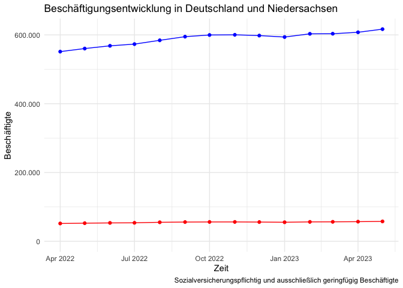
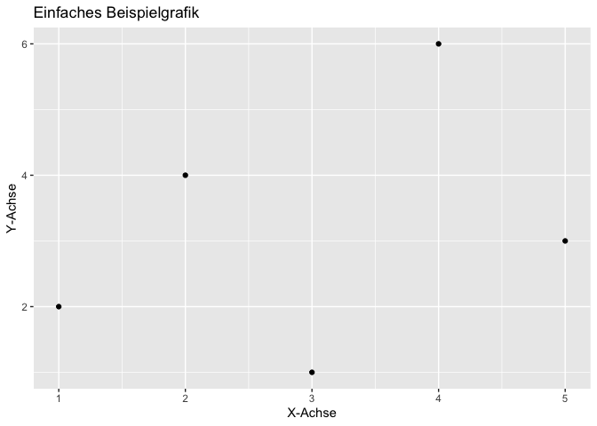

V2
================

## Row

### Grafik 1


### Grafik 2

<!-- -->

### Grafik 3

``` r
# Daten erstellen
data <- data.frame(x = 1:5, y = c(2, 4, 1, 6, 3))

# Plot erstellen
library(ggplot2)
plot <- ggplot(data, aes(x, y)) +
  geom_point() +
  labs(title = "Einfaches Beispielgrafik", x = "X-Achse", y = "Y-Achse")

# Die Grafik anzeigen
print(plot)
```

<!-- -->

## Row

### Grafik 4

``` r
# R-Chunk für Grafik 4
```

### Grafik 5

``` r
# R-Chunk für Grafik 5
```

### Grafik 6

``` r
# R-Chunk für Grafik 6
```

## \# Einführung mit Grafik

Word, Pdf, html, tex. Ich bin ja mal gespannt.

## \# Einbuergerungen in Niedersachsen

Die folgende Grafik zeigt die Entwicklung der Einbuergerungen in
Niedersachsen in den vergangenen 12 Monaten.


## \## Beschäftigte

<!-- -->
