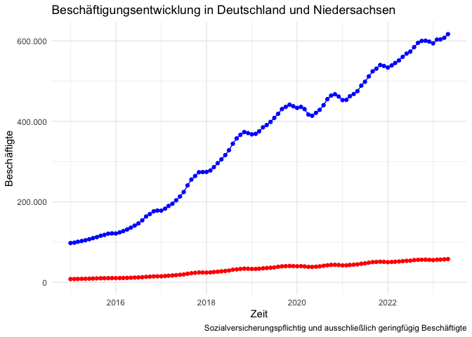

V2
================

## Row

### Grafik 1


### Grafik 2

<!-- -->

### Grafik 3

``` r
# R-Chunk für Grafik 3
```

## Row

### Grafik 4

``` r
# R-Chunk für Grafik 4
```

### Grafik 5

``` r
# R-Chunk für Grafik 5
```

### Grafik 6

``` r
# R-Chunk für Grafik 6
```

## \# Einführung mit Grafik

Word, Pdf, html, tex. Ich bin ja mal gespannt.

## \# Einbuergerungen in Niedersachsen

Die folgende Grafik zeigt die Entwicklung der Einbuergerungen in
Niedersachsen in den vergangenen 12 Monaten.


## \## Beschäftigte
